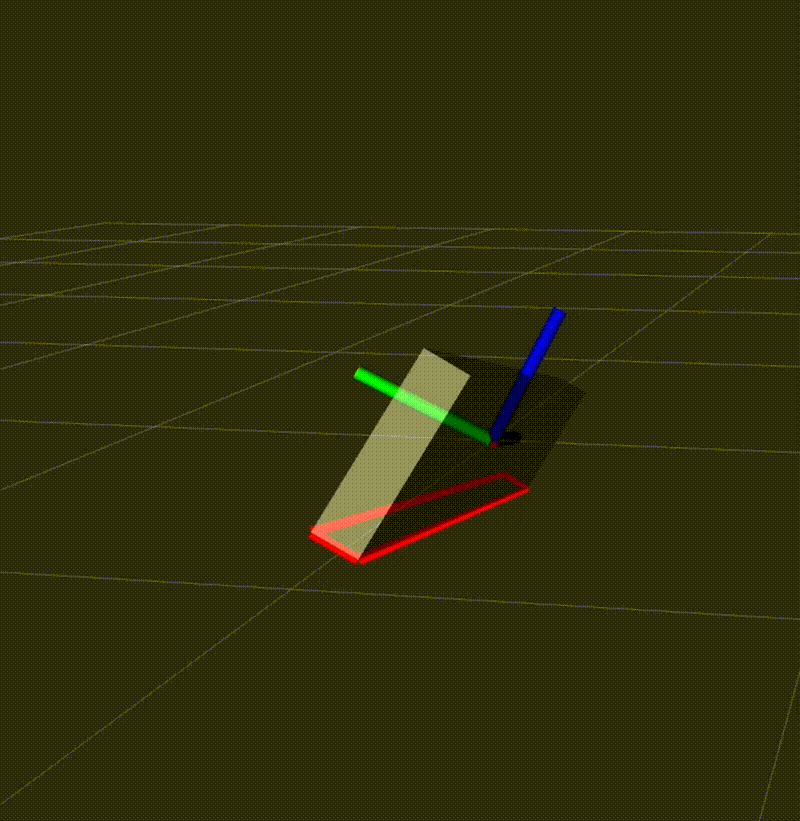
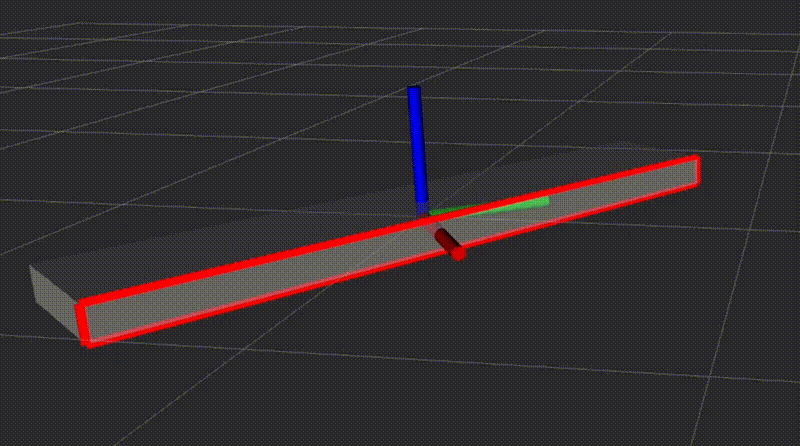

# intermediate_axis_theorem_sim

Simulation of the intermediate axis theorem (as known as the tennis racket theorem or the Dzhanibekov effect).

## Euler’s equation of rigid body motion (Euler's rotation equations)

- General vector form
    
    $$
    
    \begin{aligned}
    \mathbf{I} \, \dot{\bm{\omega}} + \bm{\omega} \times \left( \mathbf{I} \, \bm{\omega} \right) = \mathbf{M}
    \end{aligned}
    $$
    
- Under torque-free condition
    
    $$
    \begin{aligned}
    I_1 \dot{\omega}_1 + (I_3 - I_2) \omega_2 \omega_3 &= 0 \\
    I_2 \dot{\omega}_2 + (I_1 - I_3) \omega_3 \omega_1 &= 0 \\
    I_3 \dot{\omega}_3 + (I_2 - I_1) \omega_1 \omega_2 &= 0
    \end{aligned}
    $$
    

## Simulation (visualised in ROS 2 RViz2)
- Mainly along $\omega_1$ ($I_1$), with small perturbations along the other two axes
    > Stable rotation


- Mainly along $\omega_3$ ($I_3$), with small perturbations along the other two axes
    > Stable rotation


- Mainly along $\omega_2$ ($I_2$) (the intermediate axis), with small perturbations along the other two axes
    > Unstable rotation (axis flip)


## Demo

Run the simulation (rigid body rotation in the three main axes, with other two being perturbed):
```bash
# Simulation in matplotlib
cd ~/intermediate_axis_theorem_sim && python3 sim.py

# Simulation in ros2 and rivz2
cd ~/intermediate_axis_theorem_sim && python3 sim_ros2.py
```