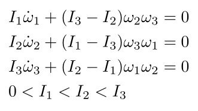

# intermediate_axis_theorem_sim

Simulation of the intermediate axis theorem (as known as the tennis racket theorem or the Dzhanibekov effect).

## Euler’s equations of rigid body motion (Euler's rotation equations)

- General vector form


    
- Under torque-free condition




## Simulation (visualised in ROS 2 RViz2)
- Rotate mainly along $\omega_1$ ($I_1$), with small perturbations along the other two axes.
    > Stable rotation
    

- Rotate mainly along $\omega_3$ ($I_3$), with small perturbations along the other two axes.
    > Stable rotation
    

- Rotate mainly along $\omega_2$ ($I_2$) (the intermediate axis), with small perturbations along the other two axes.
    > Unstable rotation (axis flipped)
    


## Demo

Run the simulation (rigid body rotation in the three main axes, with other two being perturbed):
```bash
# Simulation in matplotlib
cd ~/intermediate_axis_theorem_sim && python3 sim.py

# Simulation in ros2 and rivz2
cd ~/intermediate_axis_theorem_sim && python3 sim_ros2.py
```